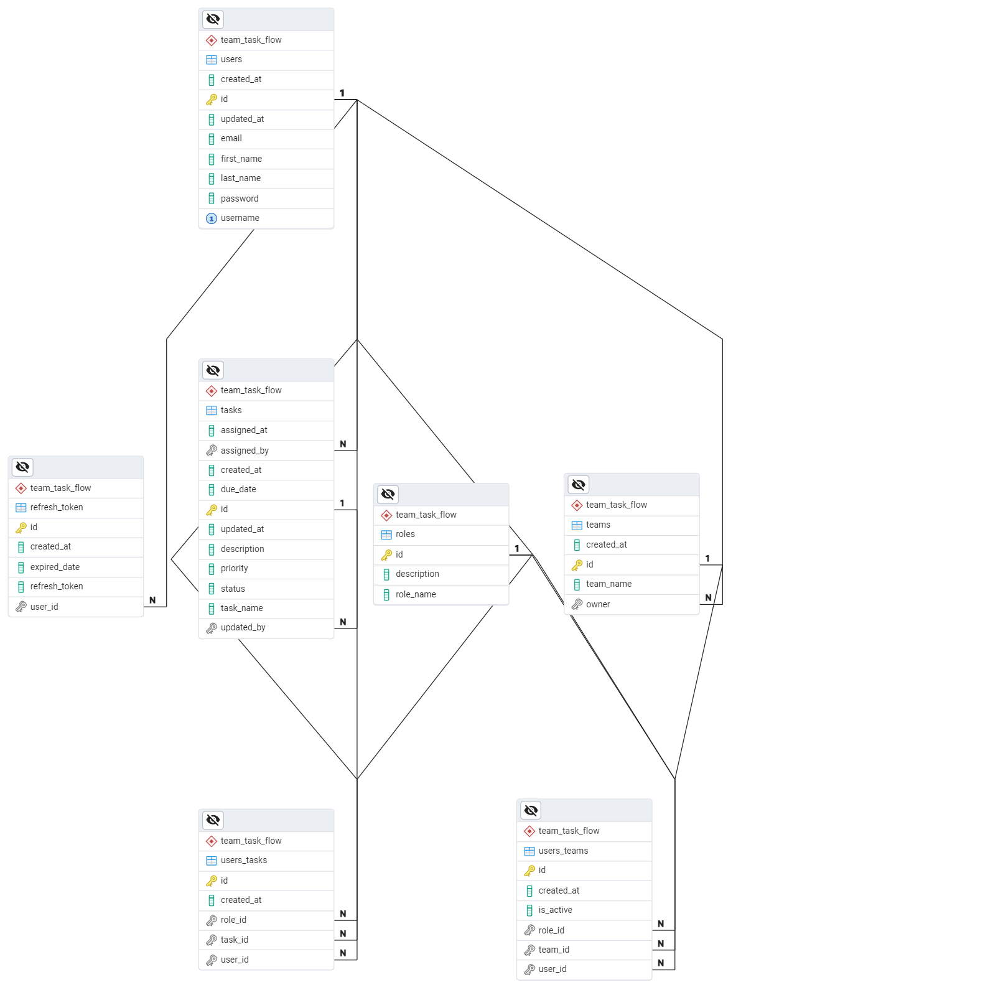

# TeamTaskFlow 🚀

TeamTaskFlow, Spring Boot kullanarak geliştirdiğim ve takım görev akışlarını yöneten demo bir projedir. Bu projede modern web uygulamaları geliştirme sürecinde edindiğim teknolojileri ve kavramları uygulama fırsatı buldum. 😄




## Özellikler ✨
- **RESTful API:** Dinamik ve genişletilebilir API geliştirme deneyimi. 📡
- **Güvenlik & JWT:** Spring Security ile güvenli giriş, JWT ile token tabanlı kimlik doğrulama. 🔐
- **Veri Yönetimi:** Spring Data JPA ve PostgreSQL ile sağlam veri işlemleri. 💾
- **Pagination:** Büyük veri setlerinde verimli listeleme ve sayfalama imkanı. 📄
- **Swagger Dokümantasyonu:** Otomatik oluşturulan Swagger UI sayesinde API dokümantasyonuna kolay erişim. 📚
- **Global Exception Handling:** Uygulama genelinde hataların merkezi olarak yönetilmesi ile temiz ve anlaşılır hata mesajları. ⚠️
- **DTO Dönüşümleri:** MapStruct ile nesneler arası dönüşümleri kolaylaştırma. 🔄
- **Kod Temizliği:** Lombok sayesinde tekrarlayan kodları azaltarak daha okunabilir bir yapı. 🧹

## Öğrendiklerim 🎓
Bu projede çalışırken:
- **Java 17** ile modern Java özelliklerini keşfettim. ☕️
- **Spring Boot** sayesinde hızlı ve esnek uygulama geliştirme tecrübesi edindim. ⚡️
- **Spring Security & JWT** ile uygulamalara güvenlik katmanlarını nasıl entegre edeceğimi öğrendim. 🔒
- **Pagination** kullanarak büyük veri setlerini daha verimli yönetmeyi deneyimledim. 🗂️
- **Swagger** ile API dokümantasyonunu otomatikleştirmenin ne kadar pratik olduğunu gördüm. 📖
- **Global Exception Handling** sayesinde hataların merkezi yönetimini ve daha temiz hata raporlamayı öğrendim. 🚨
- **Spring Data JPA** ve **PostgreSQL** ile veritabanı işlemlerinde pratik yaptım. 🛢️
- **MapStruct** ve **Lombok** kullanarak kod yazımını hızlandırıp, daha temiz ve bakımı kolay hale getirdim. ✨


## Kurulum ve Çalıştırma 🛠️
Projeyi yerel makinenizde çalıştırmak için şu adımları izleyebilirsiniz:

1. **Depoyu Klonlayın:**
   ```bash
     git clone https://github.com/Eraycann/TeamTaskFlow.git
     cd TeamTaskFlow
     ```
2. **Projeyi Derleyin:**
   ```bash
    ./mvnw clean install
    ```
   (Alternatif olarak mvn clean install komutunu da kullanabilirsiniz.)
3. **Uygulamayı Başlatın:**
   ```bash
    ./mvnw spring-boot:run
     ```
  (Uygulama, varsayılan olarak http://localhost:8080 adresinde çalışacaktır.)

## Yapılandırma ⚙️
Uygulamanın ayarlarını src/main/resources/application.properties veya application.yml dosyasında yapabilirsiniz. Örneğin, PostgreSQL yapılandırması şu şekilde olabilir:

   ```bash
    spring.datasource.url=jdbc:postgresql://localhost:5432/teamtaskflow_db
    spring.datasource.username=your_username
    spring.datasource.password=your_password
    spring.jpa.hibernate.ddl-auto=update
  ```
Ayrıca Swagger ve global exception handling ile ilgili ek ayarlar da bu dosyada yapılandırılabilir.


## Lisans 📄
Bu proje MIT Lisansı kapsamında lisanslanmıştır.

